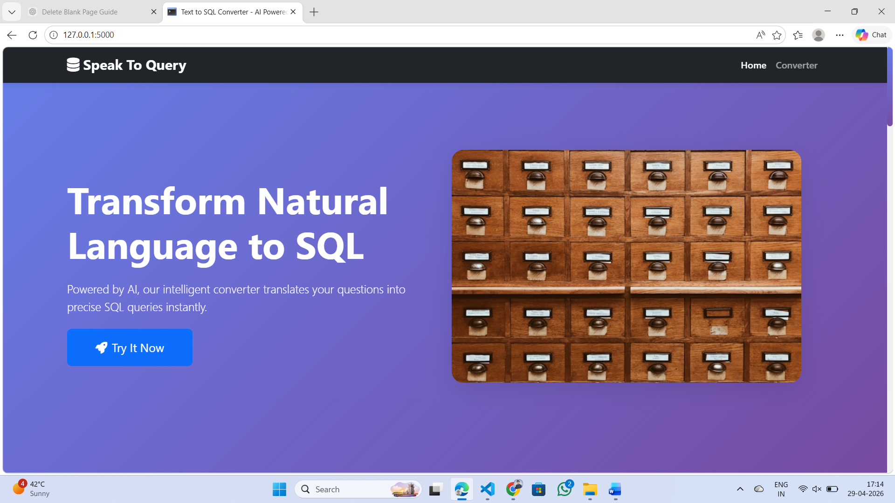
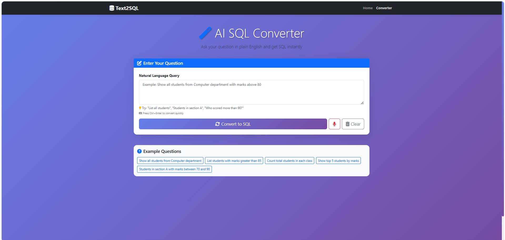
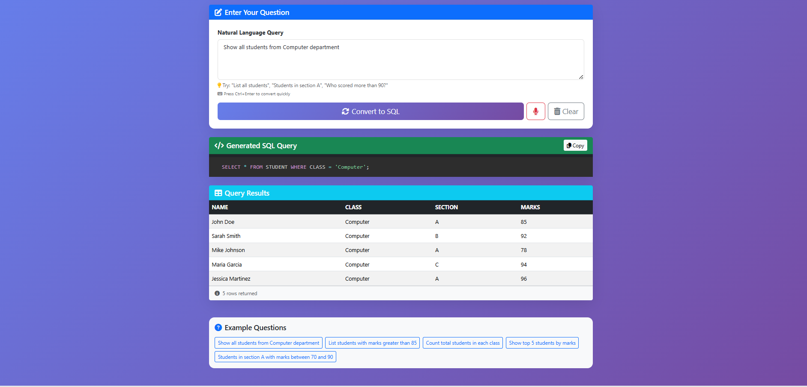
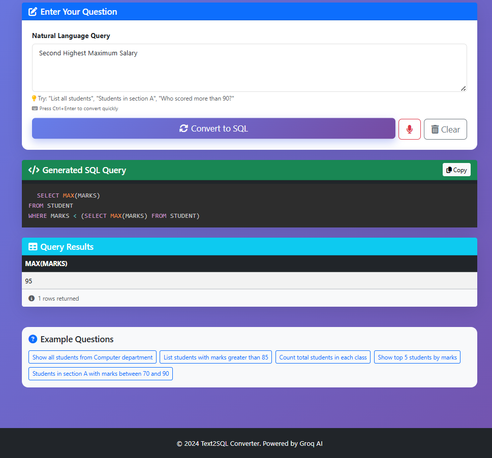
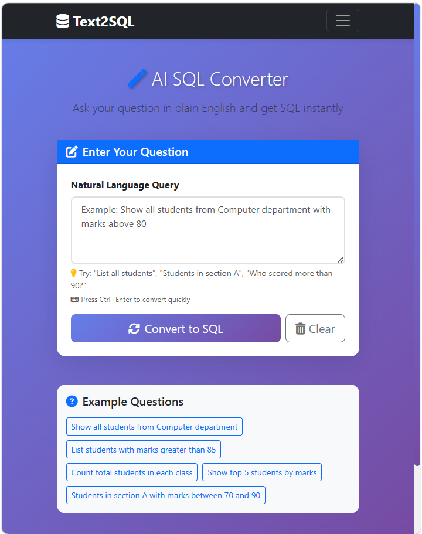

# Text to SQL Converter - AI Powered Web Application

A beautiful, responsive web application that converts natural language questions into SQL queries using AI (Groq LLaMA 3.3).

## 🌟 Features

- **AI-Powered Conversion**: Uses Groq's LLaMA 3.3 model for accurate SQL generation
- **Beautiful UI**: Modern, responsive design with Bootstrap 5
- **Smooth Animations**: AOS animations and custom CSS effects
- **Syntax Highlighting**: SQL queries displayed with Prism.js
- **Real-time Execution**: See query results instantly
- **Interactive Examples**: Pre-built example queries to get started
- **Responsive Design**: Works perfectly on desktop, tablet, and mobile

## 📋 Prerequisites

- Python 3.8 or higher
- Groq API key (free at https://console.groq.com/)
- SQLite database with STUDENT table

## 🚀 Installation

1. **Clone or download this project**

2. **Install dependencies**
```bash
pip install -r requirements.txt
```

3. **Set up environment variables**
   - Copy `.env.example` to `.env`
   - Add your Groq API key:
   ```
   GROQ_API_KEY=your-groq-api-key-here
   ```

4. **Ensure your database exists**
   - Make sure you have `student.db` in the project root
   - It should contain a STUDENT table with columns: NAME, CLASS, SECTION, MARKS

## 💻 Running the Application

1. **Start the Flask server**
```bash
python app.py
```

2. **Open your browser**
   - Navigate to `http://localhost:5000`
   - You'll see the homepage with project information

3. **Try the converter**
   - Click "Try It Now" or navigate to `/converter`
   - Enter your question in natural language
   - Click "Convert to SQL" to see the magic!

## 🎯 Example Queries

Try these example questions:
- "Show all students from Computer department"
- "List students with marks greater than 85"
- "Count total students in each class"
- "Show top 5 students by marks"
- "Students in section A with marks between 70 and 90"

## 📁 Project Structure

```
text_to_sql_website/
├── app.py                      # Flask application
├── requirements.txt            # Python dependencies
├── .env.example               # Environment variables template
├── student.db                 # SQLite database (you need to create this)
├── templates/
│   ├── index.html            # Home page
│   └── converter.html        # Converter page
├── static/
│   ├── css/
│   │   └── style.css         # Custom styles
│   └── js/
│       └── converter.js      # Converter functionality
└── README.md                  # This file
```

## 🏠 Home Page


## 🔍 Query Example 1


## 🔍 Query Example 2


## 🔍 Query Example 3


## 📱 Responsive Design


## 🛠️ Technologies Used

### Backend
- **Flask**: Python web framework
- **Groq API**: AI model (LLaMA 3.3)
- **SQLite**: Database

### Frontend
- **Bootstrap 5**: UI framework
- **Font Awesome**: Icons
- **AOS**: Scroll animations
- **Prism.js**: Syntax highlighting
- **Custom CSS**: Animations and styling

## 🎨 Features Breakdown

### Home Page
- Hero section with project introduction
- "How It Works" cards with icons
- Complete process flow timeline
- Database schema visualization
- Key features showcase
- Call-to-action section

### Converter Page
- Large textarea for natural language input
- Convert and Clear buttons
- Loading spinner during AI processing
- SQL query display with syntax highlighting
- Results table with smooth animations
- Example queries for quick testing
- Copy-to-clipboard functionality
- Keyboard shortcuts (Ctrl/Cmd+Enter)

## 🔧 Customization

### Change Database Schema
Edit the system prompt in `app.py`:
```python
"content": """Your custom schema here"""
```

### Modify Styling
Edit `static/css/style.css` to customize colors, animations, and layout

### Add More Pages
Create new HTML templates in `templates/` and add routes in `app.py`

## 📱 Responsive Design

The application is fully responsive and works on:
- Desktop (1920px and above)
- Laptop (1024px - 1919px)
- Tablet (768px - 1023px)
- Mobile (320px - 767px)

## 🐛 Troubleshooting

**Issue**: "Error code: 401" when converting
- **Solution**: Check your Groq API key in `.env` file

**Issue**: "Table STUDENT not found"
- **Solution**: Create the database with proper schema

**Issue**: No results showing
- **Solution**: Check if your database has data

## 📄 License

This project is open source and available under the MIT License.

## 👏 Credits

- AI Model: Groq LLaMA 3.3
- UI Framework: Bootstrap 5
- Icons: Font Awesome
- Animations: AOS Library

## 🤝 Contributing

Feel free to fork this project and submit pull requests for improvements!

## 📧 Support

If you have any questions or issues, please open an issue on GitHub.

---

Made with ❤️ using Flask, Groq AI, and Bootstrap
